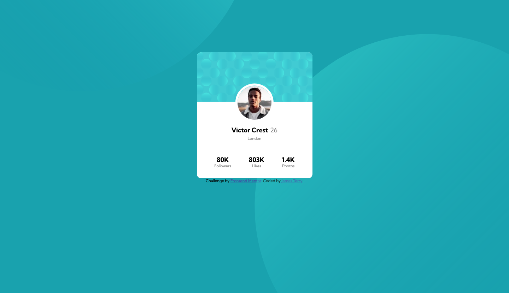
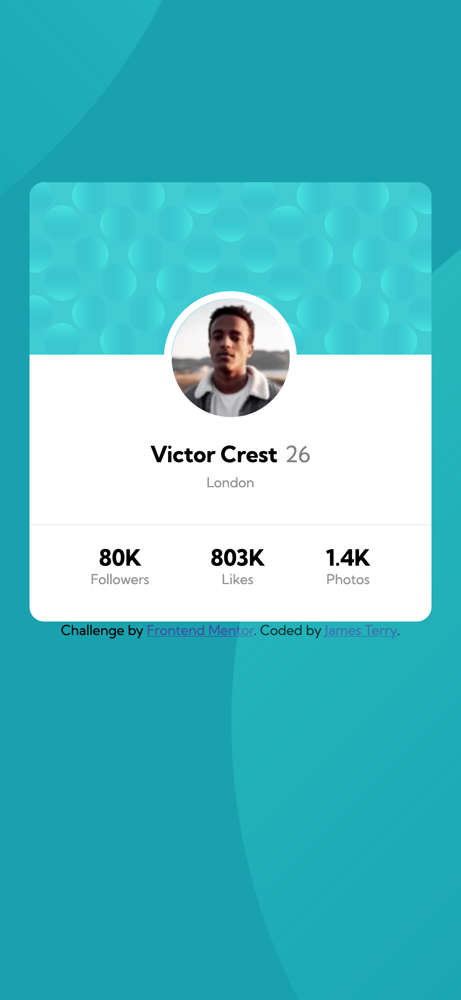

# Frontend Mentor - Profile card component solution

This is a solution to the [Profile card component challenge on Frontend Mentor](https://www.frontendmentor.io/challenges/profile-card-component-cfArpWshJ). Frontend Mentor challenges help you improve your coding skills by building realistic projects. 

## Table of contents

- [Overview](#overview)
  - [The challenge](#the-challenge)
  - [Screenshot](#screenshot)
  - [Links](#links)
- [My process](#my-process)
  - [Built with](#built-with)
  - [What I learned](#what-i-learned)
  - [Continued development](#continued-development)
  - [Useful resources](#useful-resources)
- [Author](#author)

## Overview

### The challenge

Users should be able to:

- View the optimal layout for the site depending on their device's screen size

### Screenshot

### Links

- Solution URL: [Source Code](https://github.com/jatsan/profile-card-component-main)
- Live Site URL: [Live Site](https://jatsan.github.io/profile-card-component-main/)

## My process

### Built with

- Semantic HTML5 markup
- CSS custom properties
- Flexbox
- Mobile-first workflow

### What I learned

I now have a better understanding of the css position property.  

### Continued development

In the future, I would like to learn SASS/SCSS to better adhere to the DRY(Don't Repeat Yourself) principle when coding css.

### Useful resources

- [MDN Web Docs CSS Guide](https://developer.mozilla.org/en-US/docs/Web/CSS)

## Author

- Frontend Mentor - [@jatsan](https://www.frontendmentor.io/profile/jatsan)
- GitHub - [jatsan](https://github.com/jatsan)